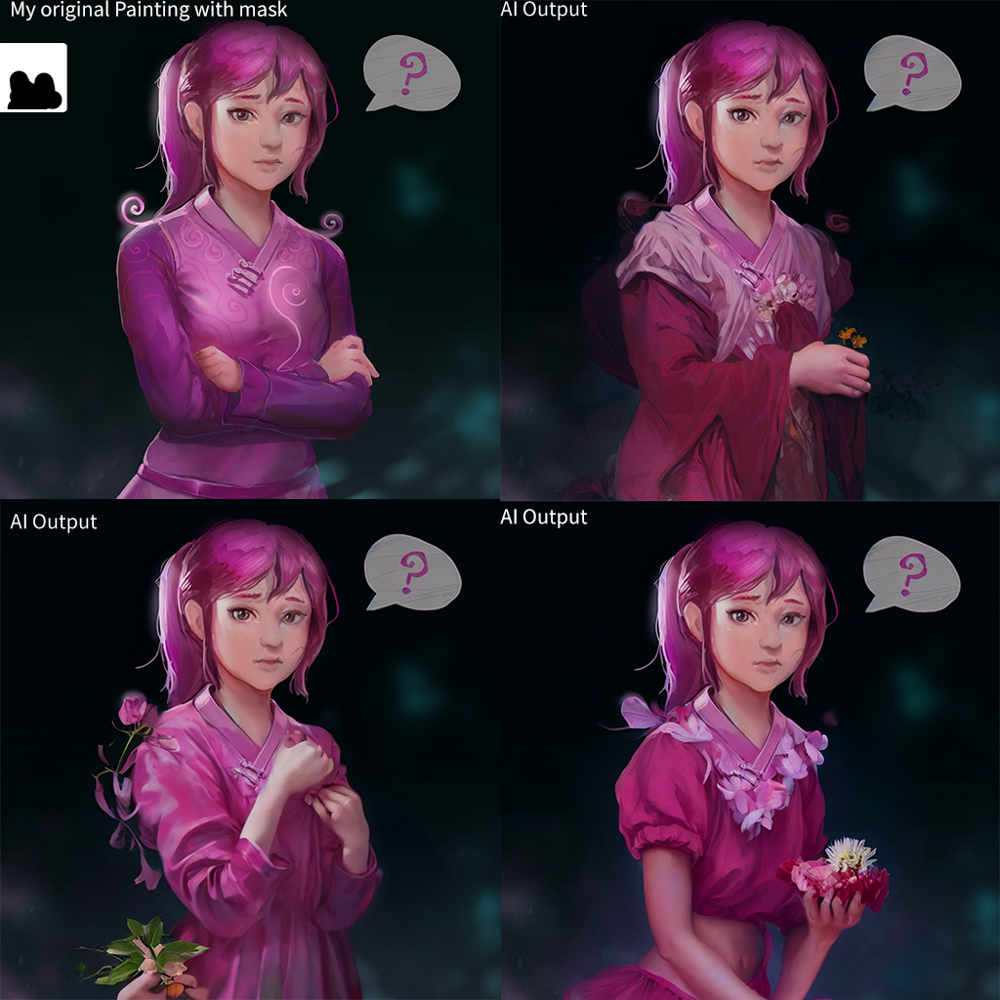

[](https://colab.research.google.com/github/deforum-art/deforum-stable-diffusion/blob/main/Deforum_Stable_Diffusion.ipynb)

[](https://replicate.com/deforum/deforum_stable_diffusion)

# Deforum Stable Diffusion Local Version
Local version of Deforum Stable Diffusion V0.6, supports txt settings file input and animation features!


- **[Stable Diffusion](https://github.com/CompVis/stable-diffusion) by Robin Rombach, Andreas Blattmann, Dominik Lorenz, Patrick Esser, Björn Ommer and the [Stability.ai](https://stability.ai/) Team.**
- **[K Diffusion](https://github.com/crowsonkb/k-diffusion) by [Katherine Crowson](https://twitter.com/RiversHaveWings).** 
- **Notebook by [deforum](https://github.com/deforum-art/deforum-stable-diffusion)**

- **Local Version by [DGSpitzer](https://www.youtube.com/channel/UCzzsYBF4qwtMwJaPJZ5SuPg) [大谷的游戏创作小屋](https://space.bilibili.com/176003)**
- **Special Thanks to [VIVY Has A Dream](https://github.com/vivyhasadream) for all the help!**


:triangular_flag_on_post: **Updates**

- :white_check_mark: 12/3/2022 Add supports for **Deforum V0.6**!!


**👇Animated Video👇**

[](https://www.youtube.com/watch?v=DCJm61yQ4_g)


Made this quick local Windows version mostly based on the Colab code by deforum, which supports very cool turbo mode animation output for Stable Diffusion!

As an artist and Unity game designer, I may not very familiar with Python code, so let me know whether there is any improvement for this project!

It's tested working on Windows 10 with RTX 2080 SUPER and RTX 3090 GPU (it runs somehow much faster on my local 3090 then Colab..), **I haven't tested it on Mac though.**

## Installation

You can use an [anaconda](https://conda.io/) environment to host this local project:

```
conda create --name dsd python=3.8.5 -y
conda activate dsd
```

And then cd to the cloned folder, run the setup code, and wait for ≈ 5min until it's finished

```
python setup.py
```

## Manually download 3 Model Files

**You need to get the `v1-5-pruned-emaonly.ckpt` file and put it on the `./models` folder first to use this. It can be downloaded from [HuggingFace](https://huggingface.co/runwayml/stable-diffusion-v1-5/tree/main).**

**Additionally, you should put `dpt_large-midas-2f21e586.pt` on the `./models` folder as well, [the download link is here](https://github.com/intel-isl/DPT/releases/download/1_0/dpt_large-midas-2f21e586.pt)**

**There should be another extra file `AdaBins_nyu.pt` which should be downloaded into `./models` folder, [the download link is here](https://cloudflare-ipfs.com/ipfs/Qmd2mMnDLWePKmgfS8m6ntAg4nhV5VkUyAydYBp8cWWeB7/AdaBins_nyu.pt)**


## How to use it?
The running command should looks like this:
```
python run.py --enable_animation_mode --settings "./runSettings_Template.txt" --model "v1-5-pruned-emaonly.ckpt"
```

After installation you can try out following examples to see if the code is working
- 1. For generate still images:
```
python run.py --settings "./examples/runSettings_StillImages.txt"
```
- 2. For animation feature, you need to add `--enable_animation_mode` to enable animation settings in text file:
```
python run.py --enable_animation_mode --settings "./examples/runSettings_Animation.txt"
```
- 3. For mask feature:
```
python run.py --settings "./examples/runSettings_Mask.txt"
```
- 4. For new feature of Deforum V0.6:
```
python run.py --enable_animation_mode --settings "./examples/runSettings_AnimationExtra.txt"
```


[Original Painting on Artstation](https://www.artstation.com/artwork/yVyG3)

**The output results will be available at `./output` folder.**

All the needed variables & prompts for Deforum Stable Diffusion are set in the txt file (You can refer to the [Colab](https://colab.research.google.com/github/deforum/stable-diffusion/blob/main/Deforum_Stable_Diffusion.ipynb) page for definition of all the variables), you can have many of settings files for different tasks. There is a template file called `runSettings_Template.txt`. You can create your own txt settings file as well.


That's it! 
